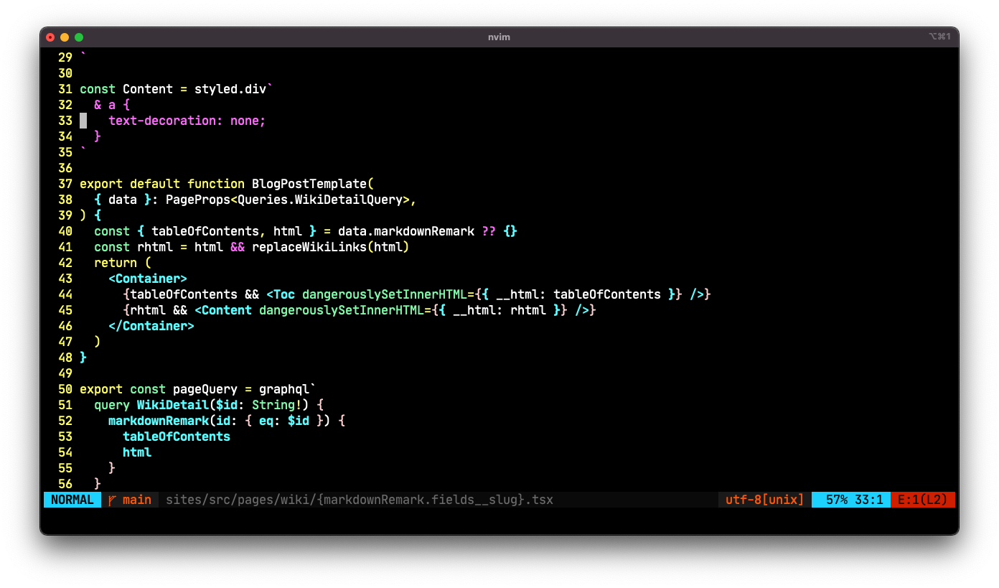

# VIM

I use [neovim](https://neovim.io/) as my main editor.

## Prerequisite

### (optional) ag _silver searcher_, rg _ripgrep_ for fzf.vim

```bash
brew install rg
brew install ag

install tools step by step: neovim -> vim-plug -> vim plugins `PlugInstall`

symlink commands:

```bash
ln -s ~/dotfiles/vim/.vimrc ~                    # .vimrc
ln -s ~/dotfiles/vim/init.lua ~/.config/nvim     # init.lua
ln -s ~/dotfiles/vim/vim-include ~/.config/nvim  # my custom scripts
ln -s ~/dotfiles/vim/lua/ ~/.config/nvim         # my custom lua scripts
```

# Snapshots

codes


